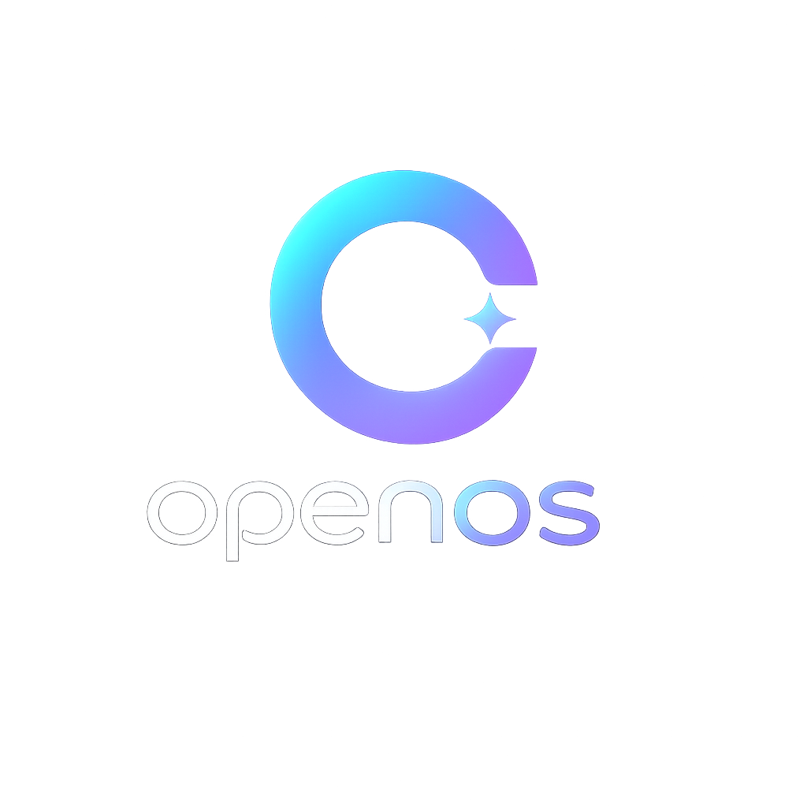

# 🧠 OpenOS — The AI Operating System

<p align="center">
  
</p>

<p align="center">
  <strong>A Debian-based operating system where AI is the interface.</strong><br>
  Talk to your computer. It understands.
</p>

---

## 🌟 What is OpenOS?

OpenOS replaces traditional menus, terminals, and app launchers with a single AI interface.
Instead of remembering commands or clicking through menus, just say what you want:

```
openos "open my project files"
openos "clean my system"
openos "prepare my work setup"
openos "play some music"
```

**Normal OS:** User → App → Action
**OpenOS:** User → AI → Action

## ✨ Key Features

| Feature | Description |
|---------|-------------|
| 🗣️ **Natural Language Control** | Type or speak commands in plain English |
| ⚡ **AI Task Automation** | Complete multi-step tasks with one command |
| 📁 **Smart File Management** | Auto-organize, deduplicate, suggest cleanup |
| 🧠 **Personalized Memory** | Learns your habits and daily routines |
| 💻 **AI Shell** | Replace complex Linux commands with natural language |
| 🔧 **Self-Maintenance** | Auto-clean, update, and optimize your system |
| 🔔 **Intelligent Notifications** | Only useful alerts, never spam |
| 🤖 **Built-in AI Assistant** | ChatGPT-style assistant that knows your system |
| 🎙️ **Voice Control** | "Hey OpenOS, open YouTube" |
| 🧩 **Modular Design** | Add/remove AI modules and plugins |

## 🏗️ Architecture

```
User
 ↓
AI Interface (CLI / Voice / GUI)
 ↓
AI Brain (Ollama LLM + Function Calling)
 ↓
Task Engine (Tool Modules)
 ↓
Linux System (Debian Bookworm)
 ↓
Kernel
```

## 🚀 Quick Start

### Prerequisites
- Debian 12+ or Ubuntu 22.04+
- Python 3.11+
- 4GB+ RAM (8GB recommended for 7B model)

### Install

```bash
# Clone the repository
git clone https://github.com/yashab-cyber/openos.git
cd openos

# Install dependencies
make install

# Start using OpenOS
openos "hello, what can you do?"
```

### Build ISO

```bash
# Build the full bootable ISO (requires root)
make iso
```

## 📖 Documentation

- [Architecture Guide](docs/ARCHITECTURE.md)
- [User Guide](docs/USER_GUIDE.md)
- [ISO Build Guide](docs/isobuild.md)

## 🛡️ Privacy & Security

- **100% Local AI** — All AI processing happens on your machine via Ollama
- **No Cloud Required** — Works fully offline after initial setup
- **Safety Confirmations** — Destructive commands always require explicit approval
- **Open Source** — Every line of code is auditable

## 💖 Support & Connect

If you'd like to support the development of OpenOS or connect with the creator, feel free to reach out:

* **Support/Donations**: See [donate.md](donate.md) (inquiries at [yashabalam9@gmail.com](mailto:yashabalam9@gmail.com) / [yashabalam707@gmail.com](mailto:yashabalam707@gmail.com))
* **X / Twitter**: [@Yashab_cyber](https://x.com/Yashab_cyber)
* **LinkedIn**: [Yashab Alam](https://www.linkedin.com/in/yashab-alam)
* **Instagram**: [@yashabcyber](https://www.instagram.com/yashabcyber)
* **Threads**: [@yashabcyber](https://www.threads.net/@yashabcyber)

## 📜 License

GPL-3.0-or-later — Free as in freedom.
